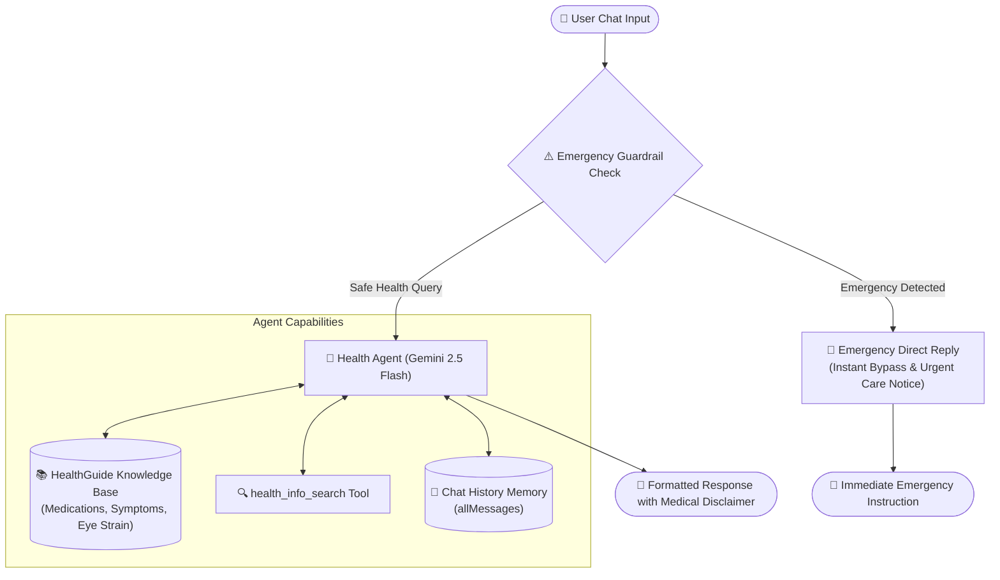

# 🩺 Healthguide AI Agents

[](https://flowiseai.com)
[](https://deepmind.google/technologies/gemini/)
[](#-safety-guardrails--boundaries)
[](LICENSE)

An intelligent, safety-first healthcare conversational agentflow built with **Flowise AI** and powered by **Google Gemini 2.5 Flash**. **Healthguide AI** provides clear, concise, and grounded health guidance, symptom explanations, and medication information while enforcing strict guardrails and instant triage for medical emergencies.

---

## 📌 Table of Contents

- [Overview](#-overview)
- [Workflow Architecture](#-workflow-architecture)
- [Key Features](#-key-features)
- [Node Breakdown](#-node-breakdown)
- [Safety Guardrails & Boundaries](#-safety-guardrails--boundaries)
- [Getting Started](#-getting-started)
  - [Prerequisites](#prerequisites)
  - [Importing into Flowise](#importing-into-flowise)
  - [Environment & Credentials](#environment--credentials)
- [Example Scenarios](#-example-scenarios)
- [Disclaimer](#-medical-disclaimer)

---

## 🌟 Overview

Navigating general health inquiries requires a balance of accessibility, accuracy, and rigorous safety. **Healthguide AI Agents** is architected to separate urgent emergency scenarios from standard informational requests. Using conditional logic and retrieval-augmented generation (RAG), the system guarantees that critical symptoms trigger an immediate emergency alert, while safe queries are handled by an AI agent grounded in a verified medical knowledge base.

---

## 🏗 Workflow Architecture



---

## ✨ Key Features

- **🚨 Automated Emergency Triage**: Pre-screen user queries against critical emergency triggers (e.g., cardiac symptoms, severe respiratory distress, acute trauma) to instantly direct users to emergency services.
- **🧠 Google Gemini 2.5 Flash Engine**: Fast, empathetic, and nuanced natural language understanding and generation.
- **📚 Grounded Knowledge Base (RAG)**: Integrates a dedicated document store containing verified information on symptoms, eye strain, and common medications.
- **🛠 Tool-Augmented Search**: Leverages a `health_info_search` custom tool to query medical documentation dynamically when needed.
- **🛡 Strict Guardrail Enforcement**: Explicit system rules prevent diagnosis, dosage prescription, and unauthorized collection of personally identifiable health information.
- **💬 Conversational Memory**: Preserves context across multi-turn user conversations for coherent assistance.
- **📋 Structured Output**: Delivers digestible answers (under 150 words) with structured subheadings: *Uses*, *Precautions*, and *Common Side Effects*.

---

## 🧩 Node Breakdown

The Agentflow configuration in [`Agentflow/Healthguide_AI_Agents.json`](file:///c:/Users/shrij/Desktop/Healthguide_AI_Agents/Agentflow/Healthguide_AI_Agents.json) consists of the following nodes:

| Node ID | Node Name | Type | Description |
| :--- | :--- | :--- | :--- |
| `startAgentflow_0` | **Start** | `startAgentflow` | Receives incoming chat queries (`chatInput`) and passes `{{question}}` to downstream nodes. |
| `conditionAgentflow_0` | **conditional_loop** | `conditionAgentflow` | Evaluates whether the user's input contains emergency indicators or critical symptoms. |
| `directReplyAgentflow_0` | **Alert** | `directReplyAgentflow` | Returns an instant emergency response when critical symptoms are flagged. |
| `agentAgentflow_0` | **Health Agent** | `agentAgentflow` | Core conversational agent powered by `chatGoogleGenerativeAI` (`gemini-2.5-flash`), connected to memory, custom search tools, and document stores. |
| `stickyNoteAgentflow_0-2` | **Sticky Notes** | `stickyNoteAgentflow` | In-flow documentation describing emergency bypass routing and agent responsibilities. |

---

## 🛡 Safety Guardrails & Boundaries

The Health Agent enforces strict clinical safety protocols in its system instructions:

1. **No Medical Diagnosis**: Never tells users they have a specific disease or condition. Uses phrasing such as *"Common causes may include..."* or *"This symptom is sometimes associated with..."*.
2. **No Prescription or Dosage Recommendations**: Does not provide specific milligram dosages or dosage instructions.
3. **Mandatory Medical Disclaimer**: Every advisory response ends with a clear reminder to consult a licensed medical professional.
4. **Privacy First (No PII / PHI Collection)**: Does not request, collect, or store personal identifiers, biometric data, height, weight, or personal medical histories.
5. **Factual Grounding**: Prioritizes verified document store knowledge and search tools over ungrounded generative speculation.
6. **Concise & Readable**: Formats replies in bullet points under 150 words to avoid information overload.

---

## 🚀 Getting Started

### Prerequisites

- [Node.js](https://nodejs.org/) (v18+ recommended) or [Docker](https://www.docker.com/)
- [Flowise AI](https://flowiseai.com/) installed and running
- A **Google AI Studio API Key** (for Gemini 2.5 Flash access)

### Importing into Flowise

1. **Launch Flowise**:
   ```bash
   npx flowise start
   ```
   Or access your self-hosted / cloud Flowise instance at `http://localhost:3000`.

2. **Navigate to Agentflows**:
   - Go to the **Agentflows** section on the left sidebar.
   - Click **Add New** or **Import**.

3. **Import the JSON File**:
   - Upload [`Agentflow/Healthguide_AI_Agents.json`](file:///c:/Users/shrij/Desktop/Healthguide_AI_Agents/Agentflow/Healthguide_AI_Agents.json).

### Environment & Credentials

1. **Set Up Google Generative AI Credentials**:
   - In Flowise, navigate to **Credentials** > **Google Generative AI**.
   - Enter your `GOOGLE_API_KEY`.
   - In the **Health Agent** node (`agentAgentflow_0`), select your saved credential.
2. **Configure Knowledge Base / Document Store**:
   - Connect or index your medical knowledge files into the `HealthGuide AI Knowledge Base` document store.
3. **Verify Custom Tools**:
   - Ensure the `health_info_search` tool is registered and linked to the Health Agent.

---

## 💡 Example Scenarios

### Scenario 1: General Symptom Guidance (Safe Path)
> **User**: *"I have a mild sore throat and dry cough since yesterday. What can I do at home?"*
> 
> **Health Agent**:
> - Rest and stay well-hydrated with warm liquids (such as honey-lemon tea or broth).
> - Use a cool-mist humidifier or try steam inhalation to soothe throat irritation.
> - Saltwater gargles (1/2 tsp salt in warm water) may provide temporary comfort.
> 
> *Disclaimer: I am an AI health assistant, not a doctor. If your symptoms worsen, or if you develop a high fever or difficulty swallowing, please consult a qualified healthcare professional.*

---

### Scenario 2: Emergency Alert (Bypass Path)
> **User**: *"I have severe crushing chest pain radiating to my left arm and sudden shortness of breath."*
> 
> **Alert Direct Reply**:
> > 🚨 **EMERGENCY FOUND**: The reported symptoms may require immediate medical attention. Please call emergency services (e.g., 911, 112, or your local emergency number) or go to the nearest emergency room immediately.

---

## ⚖ Medical Disclaimer

> [!WARNING]
> **Healthguide AI** is designed for educational and informational purposes only. It is **not** a diagnostic tool, certified medical device, or replacement for professional clinical evaluation, diagnosis, or treatment. Users experiencing acute pain, severe symptoms, or medical emergencies should contact their local emergency response services immediately.
